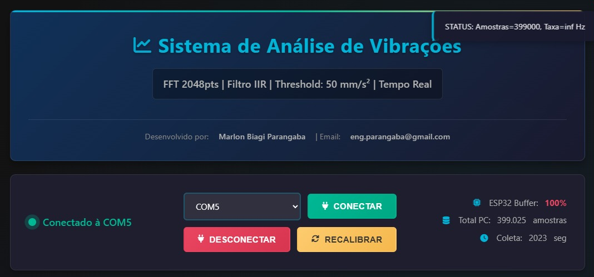
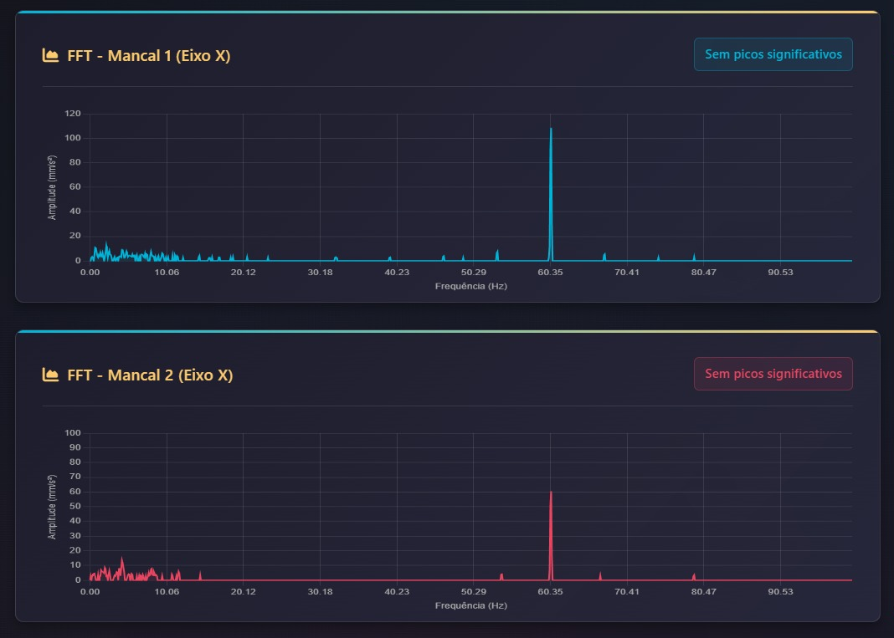
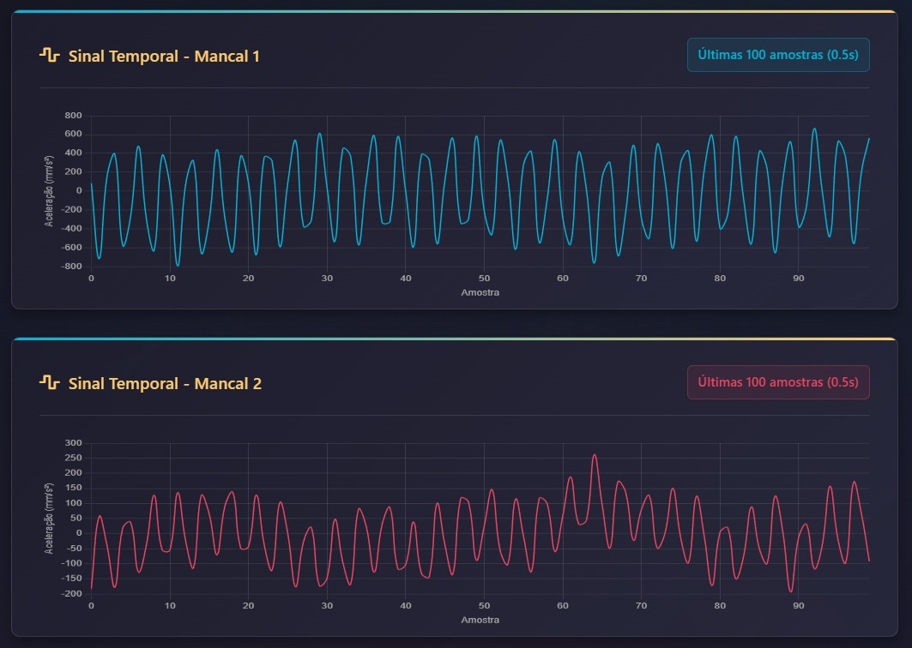
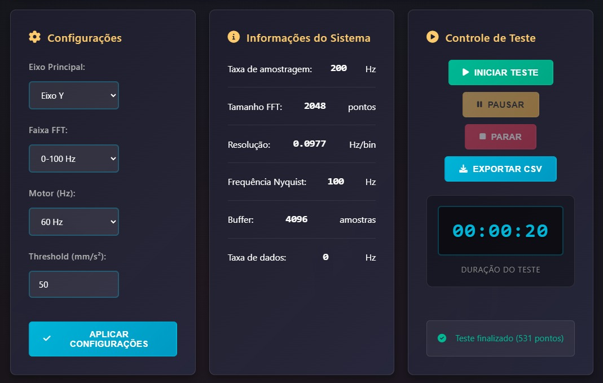

# Sistema de Análise de Vibrações v8.5.2

[](docs/Certificado_de_registro.pdf)
[](https://www.python.org/)
[](NOTICE.md)

Software técnico-científico para **aquisição, instrumentação e análise de vibrações mecânicas em sistemas rotativos**, com processamento em tempo real e aplicação de técnicas no domínio da frequência, incluindo **FFT**.

📌 Parte integrante do **Trabalho de Conclusão de Curso (TCC)** em Engenharia Mecânica.  
📄 **Software Registrado no INPI** sob o número **BR512025006741-0** - [Consulte o certificado completo](docs/Certificado_de_registro.pdf)

---

## 🏆 Registro de Propriedade Intelectual

<table>
<tr>
<td width="70%">

**Titular:** Marlon Biagi Parangaba  
**Processo INPI:** BR512025006741-0  
**Data de Criação:** 06/12/2025  
**Data de Publicação:** 09/12/2025  
**Data de Expedição:** 23/12/2025  
**Validade:** 50 anos a partir de 01/01/2026  

Este software possui **registro de programa de computador** concedido pelo Instituto Nacional da Propriedade Industrial (INPI), garantindo proteção legal dos direitos autorais até **01/01/2076**.

</td>
<td width="30%" align="center">

[](docs/Certificado_de_registro.pdf)

[](https://busca.inpi.gov.br/pePI/jsp/programas/ProgramaSearchBasico.jsp)

</td>
</tr>
</table>

### 📋 Dados Técnicos do Registro

| Campo | Informação |
|-------|-----------|
| **Título Oficial** | Software Técnico-Científico para Aquisição, Instrumentação e Análise de Vibrações Mecânicas em Sistemas Rotativos com FFT |
| **Linguagens** | C++, HTML, JavaScript, Python, CSS |
| **Campos de Aplicação** | EN-05, FQ-03, IF-01, IN-03 |
| **Tipo de Programa** | FA-04, GI-04, IT-02, SM-01, TC-01 |
| **Algoritmo Hash** | SHA-512 |
| **Chefe da DIPTO** | Erica Guimarães Correa |

> 💡 **Para validar a autenticidade do registro**, acesse o [Portal de Busca do INPI](https://busca.inpi.gov.br/pePI/jsp/programas/ProgramaSearchBasico.jsp) e pesquise pelo número do processo **BR512025006741-0** ou pelo título do software.

---

## 👤 Autor e Titular dos Direitos

**Marlon Biagi Parangaba**  
Engenheiro Mecânico  
📧 Email: [eng.parangaba@gmail.com](mailto:eng.parangaba@gmail.com)  
🔗 GitHub: [@marlon-parangaba](https://github.com/marlon-parangaba)  
📅 Desenvolvimento: Dezembro de 2025

---

## 🖥️ Interface do Sistema

### 📸 Capturas de Tela

<div align="center">

**Tela Principal - Dashboard de Monitoramento**



*Interface web responsiva com gráficos em tempo real*

---

**Análise Espectral - FFT**



*Visualização do espectro de frequências com identificação de harmônicos*

---

**Monitoramento Temporal**



*Sinais temporais dos sensores em ambos os mancais*

---

**Painel de Controle e Configurações**



*Configurações de aquisição e controle de gravação*

</div>

---

## 🚀 Como Usar o Software

### 📋 Pré-requisitos

#### Hardware Necessário

* **Computador** com porta USB disponível
* **Cabo USB Serial** para conexão
* **ESP32** (microcontrolador)
* **2× sensores MPU6050** (acelerômetro/giroscópio)
* **Multiplexador TCA9548A** (I2C Multiplexer)
* **Bancada de testes** ou equipamento rotativo para análise

#### Software Necessário

* **Python 3.8** ou superior
* **Arduino IDE** (para programar o ESP32)
* **Navegador web** moderno (Chrome, Firefox ou Edge)
* **Sistema Operacional:** Windows 10/11, Linux ou macOS

---

### ⚙️ Instalação e Configuração

#### 1️⃣ Preparar o Ambiente Python

**Windows:**
```bash
# Clonar o repositório
git clone https://github.com/marlon-parangaba/Software-de-Analise-de-Vibracoes-Mecanicas.git
cd Software-de-Analise-de-Vibracoes-Mecanicas

# Instalar dependências
pip install -r requirements.txt
```

**Linux/Mac:**
```bash
# Clonar o repositório
git clone https://github.com/marlon-parangaba/Software-de-Analise-de-Vibracoes-Mecanicas.git
cd Software-de-Analise-de-Vibracoes-Mecanicas

# Instalar dependências
pip3 install -r requirements.txt
```

#### 2️⃣ Programar o ESP32

1. Abra o **Arduino IDE**
2. Instale a biblioteca do ESP32:
   - Vá em **Arquivo → Preferências**
   - Em "URLs Adicionais", adicione: `https://dl.espressif.com/dl/package_esp32_index.json`
   - Vá em **Ferramentas → Placa → Gerenciador de Placas**
   - Procure por "ESP32" e instale
3. Abra o arquivo: `esp32/esp_vibrational_serial.ino`
4. Selecione a placa: **Ferramentas → Placa → ESP32 Dev Module**
5. Selecione a porta COM correta
6. Clique em **Upload** (→)
7. Aguarde a conclusão do upload

#### 3️⃣ Conectar o Hardware

**Esquema de Conexão:**

```
ESP32              TCA9548A           MPU6050 #1 / #2
-----              --------           ---------------
3.3V        -----> VCC
GND         -----> GND
GPIO21(SDA) -----> SDA
GPIO22(SCL) -----> SCL
                   
                   SD6 (Canal 6) ---> SDA (MPU6050 #1)
                   SC6 (Canal 6) ---> SCL (MPU6050 #1)
                   
                   SD7 (Canal 7) ---> SDA (MPU6050 #2)
                   SC7 (Canal 7) ---> SCL (MPU6050 #2)
                   
                   VCC ------------> 3.3V (comum)
                   GND ------------> GND (comum)

MPU6050 #1 e #2:
VCC -----> 3.3V (via TCA9548A)
GND -----> GND (via TCA9548A)
```

**Diagrama de Conexão:**

```
        ESP32                    TCA9548A                MPU6050
    ┌───────────┐            ┌──────────────┐
    │           │            │              │        ┌──────────┐
    │  GPIO21───┼────SDA────►│ SDA          │        │ MPU #1   │
    │  GPIO22───┼────SCL────►│ SCL          │        │          │
    │           │            │              │        │  VCC ◄───┼──3.3V
    │   3.3V────┼───────────►│ VCC       SD6├───SDA──►│ SDA     │
    │   GND─────┼───────────►│ GND       SC6├───SCL──►│ SCL     │
    │           │            │              │        │  GND ◄───┼──GND
    └───────────┘            │           SD7├───SDA──►│         │
                             │           SC7├───SCL──►│ MPU #2  │
                             │              │        │          │
                             │     Canal 6/7 │        └──────────┘
                             └──────────────┘
```

> ⚠️ **Atenção:** 
> - O TCA9548A permite múltiplos dispositivos I2C com o mesmo endereço
> - MPU6050 #1 conectado no canal 6 do TCA9548A
> - MPU6050 #2 conectado no canal 7 do TCA9548A
> - Verifique as conexões antes de energizar!

---

### ▶️ Executar o Software

#### Método 1: Script Automático (Windows)

1. Conecte o ESP32 ao computador via USB
2. Dê um duplo clique no arquivo `start.bat`
3. Uma janela de terminal será aberta
4. Aguarde a mensagem: "Server running on http://localhost:5000"
5. O navegador abrirá automaticamente

#### Método 2: Manual (Windows/Linux/Mac)

```bash
# Navegar até a pasta do projeto
cd Software-de-Analise-de-Vibracoes-Mecanicas

# Windows
python app/main.py

# Linux/Mac
python3 app/main.py
```

6. Abra o navegador e acesse: `http://localhost:5000`

---

### 🎮 Interface do Usuário

#### Tela Inicial

1. **Conectar ao ESP32:**
   - Selecione a porta COM na lista suspensa (ex: COM3, COM4)
   - Clique no botão **"Conectar"**
   - Aguarde a mensagem "Conectado com sucesso"

2. **Calibração Automática:**
   - O sistema realiza calibração automática dos sensores
   - Aguarde a conclusão (≈10 segundos)
   - Mantenha o equipamento parado durante a calibração

#### Configurações de Aquisição

**Painel de Controle:**

| Parâmetro | Descrição | Valor Padrão |
|-----------|-----------|--------------|
| **Taxa de Amostragem** | Frequência de coleta de dados | 200 Hz |
| **Pontos FFT** | Resolução da análise espectral | 2048 |
| **Limiar de Ruído** | Filtro adaptativo de ruído | Auto |
| **Janela** | Tipo de janela para FFT | Hann |

#### Monitoramento em Tempo Real

**Gráficos Disponíveis:**

1. **Sinal Temporal (Mancal 1 e 2)**
   - Visualização das vibrações no domínio do tempo
   - Eixos X, Y e Z para cada sensor
   - Atualização em tempo real

2. **Espectro de Frequência (FFT)**
   - Análise no domínio da frequência
   - Identificação de frequências dominantes
   - Harmônicos até 6ª ordem

3. **RMS (Root Mean Square)**
   - Nível de vibração global
   - Indicador de severidade
   - Histórico temporal

4. **Análise de Desbalanceamento**
   - Comparação entre mancais
   - Detecção de assimetrias
   - Indicadores visuais

---

### 📊 Realizar Testes Experimentais

#### Passo a Passo

1. **Preparar o Equipamento:**
   - Instale os sensores nos mancais do equipamento rotativo
   - Verifique as conexões
   - Ligue o equipamento em análise

2. **Iniciar Gravação:**
   - Clique em **"Iniciar Gravação"**
   - Digite um nome para o teste (ex: "Motor_1200RPM")
   - Defina a duração (segundos)
   - Clique em **"Confirmar"**

3. **Durante a Gravação:**
   - Aguarde a conclusão
   - Observe os gráficos em tempo real
   - O sistema salva automaticamente

4. **Após a Gravação:**
   - Clique em **"Parar Gravação"**
   - Os dados são salvos em `data/tests/`
   - Arquivos gerados:
     - `[nome_teste]_raw.csv` - Dados brutos
     - `[nome_teste]_fft.csv` - Análise FFT
     - `[nome_teste]_report.json` - Relatório resumido

---

### 📈 Análise dos Resultados

#### Interpretação dos Dados

**Frequência Dominante:**
- Indica a velocidade principal de rotação
- Compare com RPM nominal do motor
- Variações indicam problemas

**Harmônicos:**
- 2× frequência fundamental → Desbalanceamento
- 3× frequência fundamental → Desalinhamento
- 6× frequência fundamental → Problemas nos rolamentos

**Níveis de RMS:**
- Baixo (< 2 mm/s) → Condição boa
- Médio (2-7 mm/s) → Atenção
- Alto (> 7 mm/s) → Crítico, necessita manutenção

**Desbalanceamento:**
- Diferença < 10% entre mancais → Normal
- Diferença > 30% → Desbalanceamento significativo

---

### 💾 Exportação de Dados

#### Formatos Disponíveis

1. **CSV (Valores Separados por Vírgula)**
   - Dados brutos de aceleração
   - Espectro de frequência
   - Importável em Excel, Python, MATLAB

2. **JSON (Relatório Estruturado)**
   - Metadados do teste
   - Resumo estatístico
   - Parâmetros de configuração

#### Como Exportar

1. Clique em **"Exportar Dados"**
2. Selecione o formato desejado
3. Escolha o destino para salvar
4. Aguarde a conclusão

**Localização dos Arquivos:**
```
data/
├── tests/
│   ├── [data_hora]_[nome_teste]_raw.csv
│   ├── [data_hora]_[nome_teste]_fft.csv
│   └── [data_hora]_[nome_teste]_report.json
└── calibrations/
    └── [data_hora]_calibration.json
```

---

### 🔧 Solução de Problemas

#### Problema: "Porta COM não aparece"

**Soluções:**
- Verifique se o cabo USB está conectado
- Reinstale os drivers do ESP32
- Tente outra porta USB
- Verifique no Gerenciador de Dispositivos (Windows)

#### Problema: "Falha na comunicação serial"

**Soluções:**
- Verifique a taxa de transmissão (921600 baud)
- Reconecte o ESP32
- Reinicie o software
- Verifique se outro programa está usando a porta

#### Problema: "Sensores não calibram"

**Soluções:**
- Mantenha o equipamento completamente parado
- Aguarde o processo completo (10-15 segundos)
- Verifique as conexões I2C no TCA9548A
- Confirme que os MPUs estão nos canais 6 e 7
- Reinicie o ESP32

#### Problema: "Dados com muito ruído"

**Soluções:**
- Aumente o limiar de ruído nas configurações
- Verifique as conexões dos sensores
- Afaste de fontes de interferência eletromagnética
- Use cabos blindados
- Verifique o multiplexador TCA9548A

#### Problema: "Apenas um sensor funciona"

**Soluções:**
- Verifique se os MPUs estão em canais diferentes (6 e 7)
- Confirme alimentação do TCA9548A
- Teste cada MPU individualmente
- Verifique endereçamento I2C

---

### 📖 Exemplo de Uso Completo

#### Cenário: Análise de Motor Elétrico 1200 RPM

```
1. Preparação:
   ✓ Sensores instalados nos mancais dianteiro e traseiro
   ✓ ESP32 conectado ao laptop via USB
   ✓ TCA9548A entre ESP32 e sensores
   ✓ Motor desligado para calibração

2. Inicialização:
   ✓ Execute start.bat
   ✓ Conecte na porta COM3
   ✓ Aguarde calibração (10s)

3. Coleta de Dados:
   ✓ Ligue o motor gradualmente até 1200 RPM
   ✓ Aguarde estabilização (30s)
   ✓ Clique "Iniciar Gravação"
   ✓ Nome: "Motor_A_1200RPM_Normal"
   ✓ Duração: 60 segundos

4. Análise:
   ✓ Frequência dominante detectada: ~20 Hz
   ✓ Conversão: 20 Hz × 29.135 = 582.7 RPM
   ✓ Verifique harmônicos e desbalanceamento
   ✓ Compare leituras dos dois mancais

5. Exportação:
   ✓ Exporte dados em CSV
   ✓ Gere relatório em JSON
   ✓ Análise posterior em Python/MATLAB
```

---

### 🎓 Dicas de Uso Avançado

**Otimização da Análise:**
- Use janelas de tempo maiores para melhor resolução espectral
- Aplique média móvel para suavizar sinais
- Compare múltiplas medições para validar resultados

**Melhores Práticas:**
- Sempre calibre antes de cada sessão de testes
- Mantenha registro de todas as medições
- Documente condições operacionais (temperatura, carga, etc.)
- Realize medições periódicas para análise de tendências

**Integração com Outras Ferramentas:**
- Importe CSV no MATLAB para análises avançadas
- Use Python/Pandas para processamento em lote
- Integre com sistemas de manutenção preditiva

---

## 🎯 Características Principais

* **Alta resolução espectral:** FFT de 2048 pontos (0,0977 Hz/bin)
* **Dupla aquisição:** 2 sensores MPU6050 via I2C multiplexado (TCA9548A)
* **Taxa de amostragem:** 200 Hz (5 ms por amostra)
* **Processamento em tempo real:** FFT, RMS, harmônicos e análise de desbalanceamento
* **Filtro IIR:** suavização avançada de sinais
* **Threshold inteligente:** eliminação adaptativa de ruído
* **Conversão precisa:** Hz → RPM baseada em dados reais do motor
* **Exportação completa:** dados em CSV para análise posterior
* **Interface moderna:** aplicação web responsiva com gráficos interativos

---

## 🧪 Funcionalidades Avançadas

* Detecção automática da frequência dominante
* Cálculo de harmônicos até a 6ª ordem
* Análise comparativa de desbalanceamento entre mancais
* Monitoramento do nível de ruído em tempo real
* Gravação controlada de testes experimentais
* Exportação de dados brutos e processados
* Calibração automática dos sensores
* Interface responsiva (desktop e mobile)

---

## ⚙️ Especificações Técnicas

### Software

* **Backend:** Python 3.8+ (Flask, Socket.IO, NumPy, SciPy)
* **Frontend:** HTML5, CSS3, JavaScript (Chart.js)
* **FFT:** 2048 pontos, janela de Hann, remoção de componente DC

### Hardware

* **Microcontrolador:** ESP32 (comunicação Serial USB)
* **Multiplexador:** TCA9548A (I2C Multiplexer 8 canais)
* **Sensores:** 2× MPU6050 (acelerômetro e giroscópio de 3 eixos)
* **Protocolo:** Comunicação serial a 921600 baud
* **Buffer:** 4096 amostras (~20 s a 200 Hz)

---

## 🔄 Fatores de Conversão Frequência → RPM (Dados Experimentais)

* 10 Hz → 283 RPM (Fator 28,3)
* 20 Hz → 582,7 RPM (Fator 29,135)
* 30 Hz → 880,2 RPM (Fator 29,34)
* 40 Hz → 1176 RPM (Fator 29,4)
* 50 Hz → 1481 RPM (Fator 29,62)
* 60 Hz → 1779 RPM (Fator 29,65)

---

## 📁 Estrutura de Arquivos

```
vibration_system/
├── app/
│   ├── main.py            # Servidor principal
│   ├── serial_reader.py   # Leitor serial
│   ├── data_processor.py  # Processamento de dados
│   └── config.py          # Configurações
├── static/
│   ├── app.js             # JavaScript
│   └── style.css          # Estilos
├── templates/
│   └── index.html         # Interface principal
├── data/
│   ├── tests/             # Testes exportados
│   └── calibrations/      # Calibrações
├── docs/
│   ├── Certificado_de_registro.pdf  # Certificado de Registro INPI
│   ├── screenshots/                 # Capturas de tela da interface
│   └── manual_usuario.pdf           # Manual do usuário
├── esp32/
│   └── esp_vibrational_serial.ino   # Firmware ESP32
├── start.bat              # Script de inicialização
├── build.py               # Script de build
├── requirements.txt       # Dependências
├── CITATION.cff           # BibTeX
├── NOTICE.md              # Aviso de Registro
└── README.md              # Este arquivo
```

---

## 💻 Compatibilidade

* **Sistemas Operacionais:** Windows 10/11, Linux, macOS
* **Navegadores:** Chrome 90+, Firefox 88+, Edge 90+
* **Python:** 3.8 ou superior
* **Hardware:** ESP32 com firmware específico + TCA9548A + 2× MPU6050

---

## ⚠️ Limitações Conhecidas

* Taxa máxima de amostragem: 200 Hz por sensor
* Resolução máxima da FFT: 2048 pontos
* Faixa de frequência analisável: 0–100 Hz (limite de Nyquist a 200 Hz)
* Buffer máximo: 4096 amostras por sensor

---

## 🚀 Próximas Atualizações Planejadas

* Atualização no dimensionamento da bancada experimental, esquadrias e encaixes mecânicos
* Implementação de análise de envelope para detecção de falhas
* Integração com bancos de dados e sistemas de monitoramento (Zabbix e Grafana)
* Geração automática de relatórios técnicos em formato PDF
* Análise de tendências históricas de vibração
* Sistema de alertas automáticos por e-mail

---

## 📚 Citação Acadêmica

Se você utilizar este software em trabalhos acadêmicos ou publicações científicas, por favor cite:

### ABNT
```
PARANGABA, M. B. Software Técnico-Científico para Aquisição, Instrumentação e 
Análise de Vibrações Mecânicas em Sistemas Rotativos com FFT. [S.l.]: Software 
Registrado no INPI, 2025. Versão 8.5.2. Processo INPI nº BR512025006741-0. 
Disponível em: https://github.com/marlon-parangaba/Software-de-Analise-de-Vibracoes-Mecanicas
```

### BibTeX
```bibtex
@software{parangaba2025vibracoes,
  author = {Parangaba, Marlon Biagi},
  title = {Software Técnico-Científico para Aquisição, Instrumentação e Análise de Vibrações Mecânicas em Sistemas Rotativos com FFT},
  year = {2025},
  version = {8.5.2},
  note = {Processo INPI nº BR512025006741-0},
  url = {https://github.com/marlon-parangaba/Software-de-Analise-de-Vibracoes-Mecanicas},
  publisher = {Registro INPI},
  month = {dezembro}
}
```

---

## 🛠️ Suporte

Para dúvidas, sugestões ou suporte técnico, entre em contato:

* **Email:** [eng.parangaba@gmail.com](mailto:eng.parangaba@gmail.com)
* **GitHub Issues:** [Abrir Issue](https://github.com/marlon-parangaba/Software-de-Analise-de-Vibracoes-Mecanicas/issues)
* **Horário de atendimento:** Segunda a sexta-feira, das 9h às 17h

---

## 📜 Licença e Direitos Autorais

© 2025 Marlon Biagi Parangaba. Todos os direitos reservados.

**Este software é protegido por direitos autorais e registrado no INPI (Processo BR512025006741-0).**

A disponibilização do código-fonte neste repositório não concede, de forma implícita ou explícita, qualquer licença para uso, modificação, redistribuição ou exploração comercial sem autorização expressa do titular.

### Uso Permitido

✅ Visualização do código para fins educacionais  
✅ Citação em trabalhos acadêmicos (com devida referência)  
✅ Uso supervisionado em ambiente acadêmico (mediante autorização)

### Uso Proibido

❌ Cópia, modificação ou redistribuição sem autorização  
❌ Uso comercial ou industrial sem licença  
❌ Remoção ou alteração de avisos de copyright  
❌ Engenharia reversa para fins comerciais

Para solicitar autorização de uso, licenciamento comercial ou parcerias, entre em contato através do email [eng.parangaba@gmail.com](mailto:eng.parangaba@gmail.com).

### Proteção Legal

Este software está protegido pelas seguintes legislações:

* **Lei nº 9.609/1998** (Lei de Software)
* **Lei nº 9.610/1998** (Lei de Direitos Autorais)
* **Constituição Federal, Art. 5º, XXVII e XXVIII**

**Validade do Registro:** 50 anos a partir de 01/01/2026 (até 01/01/2076)

Para mais detalhes sobre licenciamento, consulte o arquivo [NOTICE.md](NOTICE.md).

---

## 🔗 Links Úteis

* [📄 Certificado INPI Completo](docs/Certificado_de_registro.pdf)
* [🔍 Portal INPI - Busca de Programas](https://busca.inpi.gov.br/pePI/jsp/programas/ProgramaSearchBasico.jsp)
* [📰 Revista da Propriedade Intelectual (RPI)](http://revistas.inpi.gov.br/rpi/)
* [📖 CITATION.cff](CITATION.cff)
* [⚖️ NOTICE.md](NOTICE.md)

---

**Software desenvolvido no Brasil 🇧🇷**
